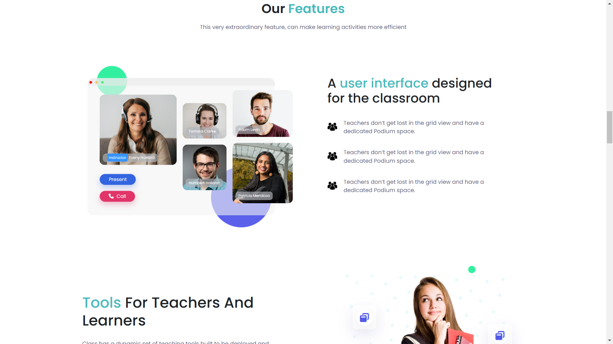

# project-e-learning-frontend

Link: https://project-e-learning.netlify.app/

## Tech-Stack Used:

- React.js
- Tailwind CSS
- JavaScript
- HTML

## Screenshots:

## Authors:

- [Uneza Fatima] (https://github.com/UnezaFatima)
- [Medhavi Tuppekar] (https://github.com/Medhavi-18)
- [Viqar Ahmed] (https://github.com/viqar-developer)
- [Manish Sahu] (https://github.com/Manishsahu116)
- [Prakash Chandra Akash] (https://github.com/impcakash)
